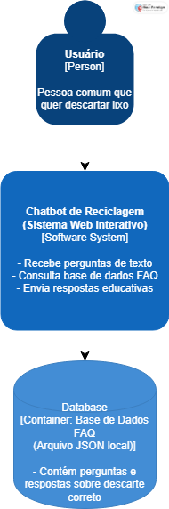
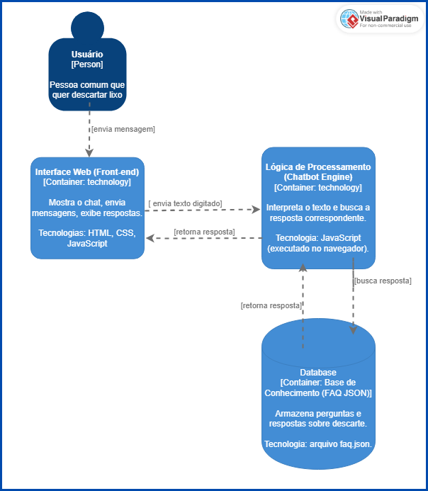
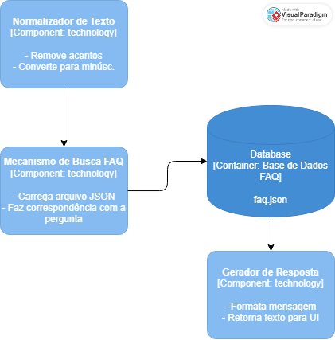

# Documentação da Arquitetura — Chatbot de Reciclagem

## 1. Visão Geral do Sistema

O **Chatbot de Reciclagem** é uma aplicação web educativa que orienta o usuário sobre o descarte correto de resíduos e práticas sustentáveis.  
O sistema utiliza uma **base de dados local em formato JSON** com perguntas e respostas pré-cadastradas (FAQ), sendo um **chatbot baseado em regras** e implementado em **JavaScript**, executado diretamente no navegador.

O sistema contribui para a **ODS 12 – Consumo e Produção Responsáveis**, promovendo conscientização ambiental.

---

## 2. Escolhas de Tecnologias

| Camada / Componente | Tecnologia | Justificativa |
|----------------------|-------------|----------------|
| **Front-end (Interface Web)** | HTML, CSS e JavaScript | Permitem criar uma interface leve, acessível e compatível com navegadores sem necessidade de backend. |
| **Chatbot Engine (Lógica de Processamento)** | JavaScript (executado no navegador) | Linguagem simples e amplamente suportada, ideal para processar mensagens e acessar dados locais. |
| **Base de Dados FAQ** | Arquivo `faq.json` (estrutura JSON) | Armazenamento leve, de fácil leitura e atualização; ideal para uma base estática de perguntas e respostas. |
| **Ferramenta de Modelagem** | Visual Paradigm | Utilizada para criar os diagramas do **C4 Model** e representar visualmente a arquitetura. |
| **Controle de Versão e Organização** | GitHub e GitHub Projects | Controle de versões, documentação e organização ágil das tarefas do projeto. |

---

## 3. Projeto Arquitetural

O projeto segue o **C4 Model**, dividido em três níveis de abstração.

### Nível 1 — Contexto do Sistema

- Mostra a interação entre o **Usuário**, o **Chatbot de Reciclagem** e a **Base de Dados FAQ**.  
- O **usuário** faz perguntas sobre descarte de resíduos.  
- O **chatbot** interpreta a pergunta e busca a resposta correspondente na base de dados.  
- A **base de dados** contém as perguntas e respostas educativas sobre reciclagem.

**Objetivo:** apresentar a visão geral e o propósito do sistema.

---

### Nível 2 — Contêineres

- **Interface Web (Front-end):** exibe o chat, envia mensagens e mostra respostas.  
- **Lógica de Processamento (Chatbot Engine):** interpreta a entrada do usuário e faz a busca na base de dados JSON.  
- **Database (FAQ JSON):** armazena as perguntas e respostas sobre descarte.  

**Fluxo principal:**  
Usuário → Interface Web → Chatbot Engine → Base de Dados → Chatbot Engine → Interface Web → Usuário.

**Tecnologia utilizada:** HTML, CSS, JavaScript e arquivo JSON.

---

### Nível 3 — Componentes

- **Normalizador de Texto:** remove acentos e converte o texto para minúsculas, facilitando a busca.  
- **Mecanismo de Busca FAQ:** carrega o arquivo JSON e encontra correspondências com a pergunta.  
- **Gerador de Resposta:** formata a mensagem e a retorna à interface.  
- **Database:** contém o arquivo `faq.json` com os dados estruturados.

**Benefício:** modularização das funções, facilitando manutenção e testes.

---

## 4. Justificativa do Modelo Escolhido

O **C4 Model** foi adotado por ser uma abordagem clara e hierárquica de documentação arquitetural.  
Ele facilita a comunicação entre desenvolvedores e stakeholders, permitindo visualizar o sistema em diferentes níveis de detalhe:

- O **Nível 1 (Contexto)** apresenta a visão macro — quem usa e para quê.  
- O **Nível 2 (Contêineres)** detalha os principais componentes técnicos e suas interações.  
- O **Nível 3 (Componentes)** aprofunda na estrutura interna do chatbot, evidenciando a lógica de funcionamento.

Essa abordagem ajuda a manter a clareza do projeto, facilitar futuras expansões (como incluir novos tipos de resíduos ou integrar APIs externas) e garantir a manutenibilidade do código.

### Nível 1 — Contexto do Sistema

### Nível 2 — Contêineres

### Nível 3 — Componentes

